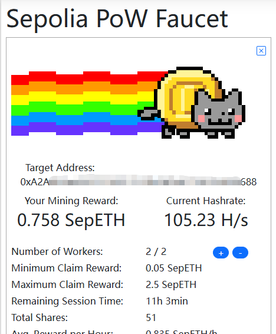
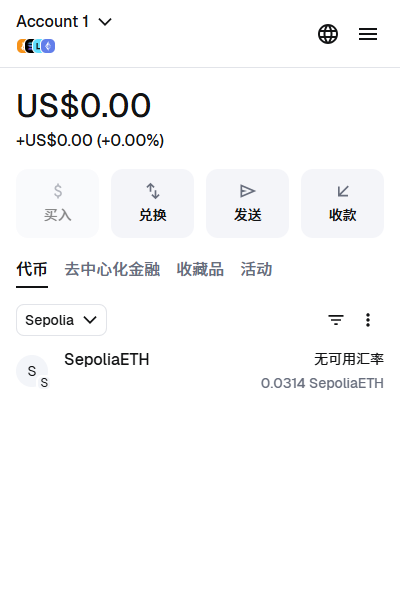
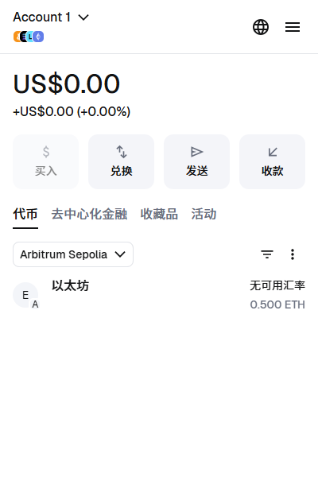
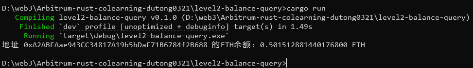
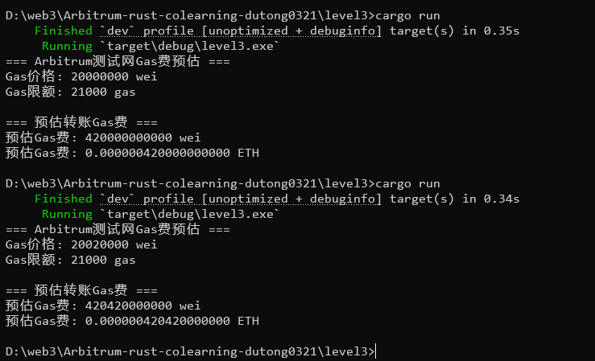

# Arbitrum-rust-colearning-dutong0321

## Task1 
因为主网没有ETH，所以采取了在[Sepolia测试币水龙头](https://sepolia-faucet.pk910.de/)进行领取测试币。

提取到metamask中的sepolia测试链。

然后通过访问 [Arbitrum 官方跨链桥测试网页面](https://bridge.arbitrum.io/?destinationChain=arbitrum-sepolia&sourceChain=sepolia) 成功把 ETH 跨链到 Arbitrum Sepolia 测试链。

## Task2
代码路径： [main.rs](level2-balance-query/src/main.rs)

运行结果如下：

## Task3
代码路径： [main.rs](level3/src/main.rs)
运行结果如下：

可以看到每次运行的Gas价格都是动态的，这是因为Arbitrum Sepolia测试网的Gas价格是动态的，会根据网络拥堵情况而变化。